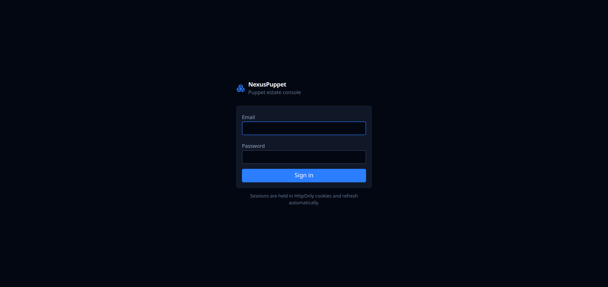
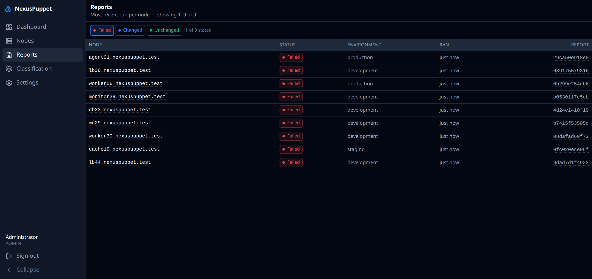
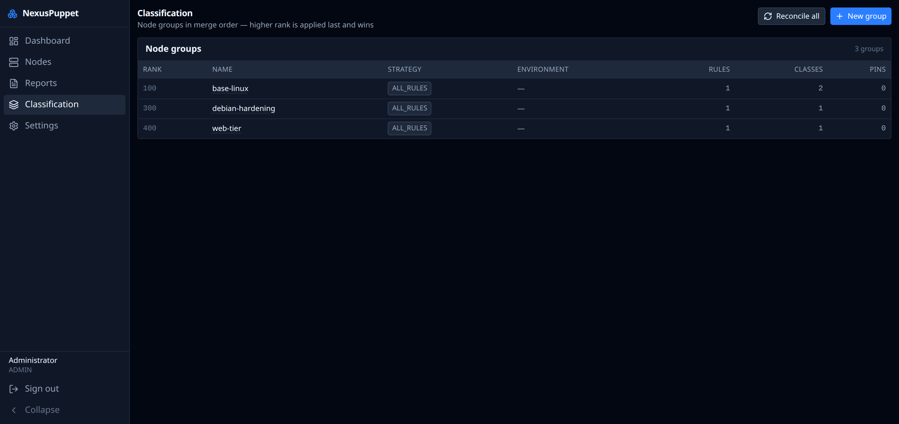
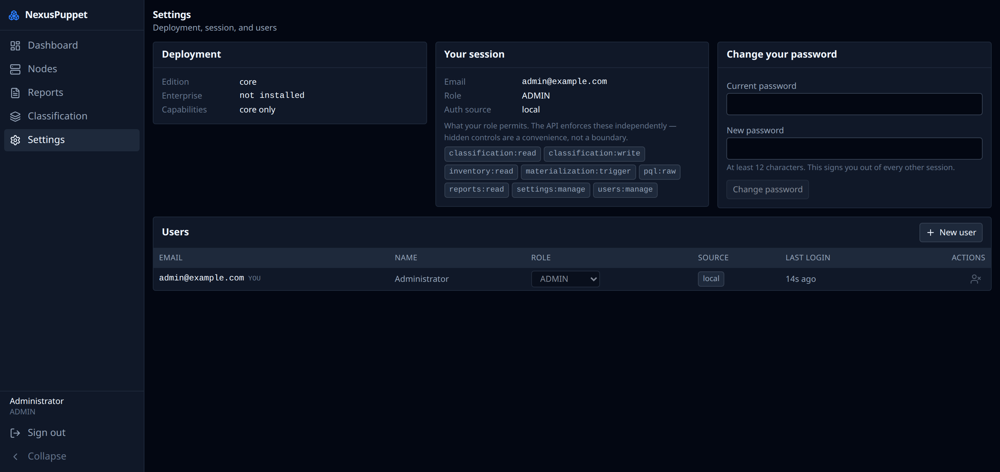

# NexusPuppet User Guide

How to use the console once it is running. If you are still installing, see the [Quickstart](../README.md#quickstart--try-it-in-2-minutes-no-puppet-required) or [DEPLOYMENT.md](../DEPLOYMENT.md).

**Contents**

1. [The one thing to understand first](#1-the-one-thing-to-understand-first)
2. [Signing in](#2-signing-in)
3. [The dashboard](#3-the-dashboard)
4. [Node inventory](#4-node-inventory)
5. [A single node](#5-a-single-node)
6. [Run reports](#6-run-reports)
7. [Classification](#7-classification)
8. [How classification reaches your nodes](#8-how-classification-reaches-your-nodes)
9. [Administration](#9-administration)
10. [Troubleshooting](#10-troubleshooting)

---

## 1. The one thing to understand first

**NexusPuppet never talks to `puppetserver`, and `puppetserver` never talks to NexusPuppet.**

When you change classification, NexusPuppet writes a YAML file to a shared directory. Your `puppetserver` reads that file during its next catalog compilation using a small shell script that makes no network calls. Nothing in a Puppet run depends on this console being alive.

Two consequences you will notice in the UI:

- **Writes are accepted, not applied.** Saving a rule returns *queued*, not *done*. The console tells you the change is queued for materialization; a moment later the file is written. This is normal and is the design working.
- **The console reads a projection, not live PuppetDB.** Facts are polled periodically and cached, so a node that checked in seconds ago may take a moment to appear. Classification rules match against that cached projection, never a live query.

If you only remember one thing: **eventual consistency is deliberate here, and it is what makes an outage of this tool harmless.**

---

## 2. Signing in



Sign in with the address and password of your account. The first administrator is seeded from `BOOTSTRAP_ADMIN_EMAIL` / `BOOTSTRAP_ADMIN_PASSWORD` the first time the API starts against an empty database; those variables do nothing afterwards and should be removed from the environment.

Repeated failed attempts lock the account temporarily. This is deliberate and applies even to correct passwords once the account is locked — wait it out, or have another administrator reset it.

If your deployment has the enterprise directory layer, the sign-in screen may offer your identity provider instead. Core deployments use local accounts only.

### Roles

| Role | Can do |
|---|---|
| **VIEWER** | Read everything: inventory, facts, reports, classification |
| **OPERATOR** | Everything a viewer can, plus create and change classification |
| **ADMIN** | Everything, plus user administration and settings |

---

## 3. The dashboard


Estate health at a glance:

- **Nodes** — active nodes PuppetDB knows about
- **Failed / Changed / Unchanged** — the status of each node's most recent Puppet run
- **Failing nodes** — the list you actually came here for, linking straight to each node and its report

*Failed* means the last run reported at least one failed resource. *Changed* means Puppet changed something — which is normal on a first run and worth a look on a supposedly converged estate. *Unknown* appears for nodes that have never reported, or are deactivated.

---

## 4. Node inventory


Every node PuppetDB knows about, with its status, environment, last run, and last fact submission.

- **Filter by certname** — a literal substring match. Regex metacharacters are matched literally, so typing `.` finds a dot rather than everything.
- **Status chips** — click to include or exclude *Failed*, *Changed*, *Unchanged*, *Unknown*.
- **Environment** — narrow to one environment. A node whose report, facts and catalog environments disagree is usually mid-migration; NexusPuppet shows the effective one and keeps all three.
- **Include deactivated** — off by default. Deactivated nodes are retained rather than deleted, because deactivation in PuppetDB is reversible.
- **Sort** by clicking a column header.

**Last run** and **Facts** can differ, and the gap is informative: facts arriving without a report usually means catalog compilation is failing.

---

## 5. A single node


Three tabs:

### Classification

**Applied groups**, in merge order, with the rank that put them there. Higher rank is applied later and wins. This is the answer to *"why does this node have that class?"*

**Materialization** tells you what has actually been written to disk:

| Field | Meaning |
|---|---|
| **File** | The YAML file `puppetserver` will read for this node |
| **Revision** | Increments only when the content genuinely changes — a no-op run does not bump it |
| **Content hash** | What the file's content hashes to; equal hashes mean no rewrite happened |
| **Written** | When the file was last actually changed |
| **Facts as of** | The age of the projection this classification was computed from |

If a change you just made is not reflected here, give it a moment — see [section 8](#8-how-classification-reaches-your-nodes).

### Facts

The **projected** facts for this node — the allow-listed subset used for rule matching, not the node's complete factset. If a fact you want to write a rule against is missing here, it is not in `PUPPETDB_PROJECTED_FACTS` and **a rule against it can never match**. See [Troubleshooting](#a-rule-matches-nothing).

### Run history

Recent Puppet runs for this node, newest first, each linking to its report.

---

## 6. Run reports



Recent runs across the estate. Open one for detail:


A report shows the run's status, environment, duration and configuration version, a summary of resource counters, and every **resource event** — what Puppet changed, what failed, and what it skipped.

For a failure, the useful parts are the **message** (Puppet's own wording, verbatim — searchable) and the **containment path**, which shows the class chain that declared the resource. That chain is usually the fastest route from *"this failed"* to *"this is the manifest to fix"*.

A skipped resource is not a failure: Puppet skips resources whose dependencies failed. In a report with one failure and several skips, the failure is the thing to fix.

---

## 7. Classification



Classification decides which Puppet classes each node receives. A **node group** has:

- **Matching rules** — which nodes belong
- **Classes** — what those nodes get, with parameters
- **Top-scope parameters** — global variables for those nodes
- **Rank** — who wins when groups disagree


### Creating a group

From **Classification → New group**, give it a name and a rank. Then add rules and classes.

### Rules

Each rule is a **fact path**, an **operator**, and a **value**.

A fact path is dotted, and addresses into structured facts:

| Path | Matches |
|---|---|
| `kernel` | `Linux` |
| `os.family` | `Debian`, `RedHat` |
| `os.release.major` | `18.04`, `9` |
| `networking.fqdn` | `web01.example.com` |
| `processors.count` | `8` |

> **Use `networking.fqdn`, not `fqdn`.** Facter 4 dropped the legacy flat facts. A Puppet 8 or OpenVox agent reports far fewer top-level facts than Puppet 7 did, and `fqdn`/`domain` now live only under `networking`.

Operators:

| Operator | Notes |
|---|---|
| `EQUALS` / `NOT_EQUALS` | Scalar comparison, type-tolerant |
| `MATCHES_REGEX` / `NOT_MATCHES_REGEX` | Regular expression against the value |
| `IN` / `NOT_IN` | Value is one of a list |
| `EXISTS` / `NOT_EXISTS` | Whether the fact is present at all |

The editor shows **how many nodes currently match** as you type, and warns if the fact path is not projected. Both are worth reading before saving.

**Strategy** decides how multiple rules combine:

- **ALL_RULES** — every rule must match (AND)
- **ANY_RULE** — any rule matching is enough (OR)
- **PINNED** — ignore rules; membership is the explicit pin list

### Classes and parameters

Assign classes by their Puppet name, e.g. `profile::base::ssh`. Names are validated against Puppet's identifier grammar **when you save**, so a typo is rejected in the UI rather than discovered as a compilation failure on a thousand nodes.

Class parameters are key/value; values may be strings, numbers, booleans, lists or maps.

### Pins

A pin adds a specific certname to a group regardless of rules. Useful for canaries and exceptions. You can pin a node that has not reported yet — the console warns, and the pin takes effect when it appears.

### When groups disagree

Groups are applied in **rank order, lowest first**, so the **highest rank wins**. Ties break by group id, so the result is always deterministic.

| Element | Rule |
|---|---|
| **Class inclusion** | Union — a class assigned by any matched group is included |
| **Class parameters** | Last writer wins, per key |
| **Top-scope parameters** | Last writer wins, per key |
| **Environment** | Last writer wins; a group with no environment does not clear an earlier one |
| **Nested values** (hash or array) | **Replaced wholesale — never deep-merged** |

Nested values are not deep-merged deliberately. Deep merge makes a parameter's effective value a function of every group in the chain, so you could not read one group and know what a node receives. Hiera exists for layered data and does it properly. ([ADR-0009](architecture/adr/0009-classification-merge-semantics.md))

**Overrides are reported, not blocked.** When one group overwrites another's parameter, the conflict is recorded with both values and the groups involved, and shown on the node's classification view. Overriding a base group is a legitimate pattern; hiding it would not be.

### Safety rails

- A node matching **zero** groups gets `default.yaml` — never an empty or missing file.
- Rendered YAML is parsed back and compared before the file is replaced. A document that fails that round-trip is never written.
- A rule change queues a **full** reconcile, because changing who matches can pull in nodes that did not match before.

---

## 8. How classification reaches your nodes

Understanding this makes the console's timing behaviour obvious.

```
 you save a change
        │
        ▼
 written to Postgres  ─── in ONE transaction ───►  outbox job + audit row
        │
        ▼
 materializer drains the outbox (seconds)
        │
        ▼
 YAML written to the ENC directory   ← content-hashed; identical content is not rewritten
        │
        ▼
 puppetserver reads the file on the node's next run   ← plain `cat`, no network
```

So a change is visible to Puppet on the node's **next run** after materialization, not instantly. Two guarantees follow:

- **Nothing is lost.** The change and its outbox job commit together. If the materializer is down, work waits rather than disappearing.
- **Nothing churns.** Identical content is not rewritten, so a no-op save does not touch a file or bump a revision.

Separately, a **projector** polls PuppetDB for changed facts and refreshes the cached projection, re-evaluating rules for nodes whose facts moved. That is why a newly-provisioned node takes a moment to appear and be classified.

---

## 9. Administration



**Settings** shows the running deployment: edition, version, and which capabilities are active. In core, the capability list is empty — that is expected, not a fault.

### Users

Administrators manage accounts under **Users**: create, change role, disable, delete, reset password.

Two protections you cannot override, both there to stop an estate locking itself out:

- You cannot remove the last active administrator.
- You cannot disable or delete your own account.

### Password changes

Changing your own password requires the current one. Doing so **revokes every other session** — the change, the audit row and the revocation happen in one transaction.

### Audit

Every classification change and every user-administration action is written with the actor, the before and after values, and a timestamp — in the same transaction as the change itself. An audit trail that could miss changes that did happen would be worse than none, because it would look authoritative.

### Triggering a reconcile

Administrators can queue a full reconcile from the console. This re-materializes every node in cursored chunks. It is safe to run at any time — it is how you recover if the ENC directory is ever lost or inconsistent.

---

## 10. Troubleshooting

### A rule matches nothing

By far the most common problem, and it is usually one of three things.

1. **The fact is not projected.** Rules match against the projected fact subset, not the full factset. Check the node's **Facts** tab: if the fact is not there, the rule can never match. Add its top-level name to `PUPPETDB_PROJECTED_FACTS` and restart the API.
2. **The fact does not exist.** `role` is not a Facter fact — it only exists if one of your modules supplies it. `fqdn` and `domain` no longer exist as flat facts on Puppet 8 or OpenVox; use `networking.fqdn`. The API logs, once per start, any projected fact that **no node reports**.
3. **The path is wrong.** `os.family`, not `osfamily`. The editor shows a live match count as you type — if it says zero for a value you can see on the Facts tab, the path is the problem.

### A node shows no classification

It matches no group, so it received `default.yaml`. That is a valid outcome, not an error. Check the group's rules and whether the group is **enabled** — a disabled group classifies nothing.

### Changes are not appearing on nodes

Check in this order:

1. The node's **Materialization** panel — did **Written** update? If not, materialization has not run yet.
2. The ENC directory — is the file there, and does `puppetserver` have it mounted read-only?
3. `puppetserver`'s `node_terminus` — is it `exec` and pointing at `nexuspuppet-enc.sh`?
4. Has the node actually run since? Classification reaches a node on its next Puppet run.

### The inventory is empty or stale

The projector polls PuppetDB periodically. If nothing appears at all, the API cannot reach PuppetDB — run `npm run test:puppetdb`, which distinguishes an unreadable key, an untrusted CA, an unauthorised certname and a wrong URL rather than reporting a generic failure.

### Everything looks down

Check whether it actually matters. If `puppetserver` still has the ENC directory mounted, **your Puppet runs are fine** — agents keep converging against the last materialized state. Fix the console at your own pace. That is the entire point of the design.

---

## See also

- [DEPLOYMENT.md](../DEPLOYMENT.md) — installing and operating it
- [CONTRIBUTING.md](../CONTRIBUTING.md) — developing it
- [Architecture](architecture/README.md) — C4 diagrams and the ADRs behind these behaviours
