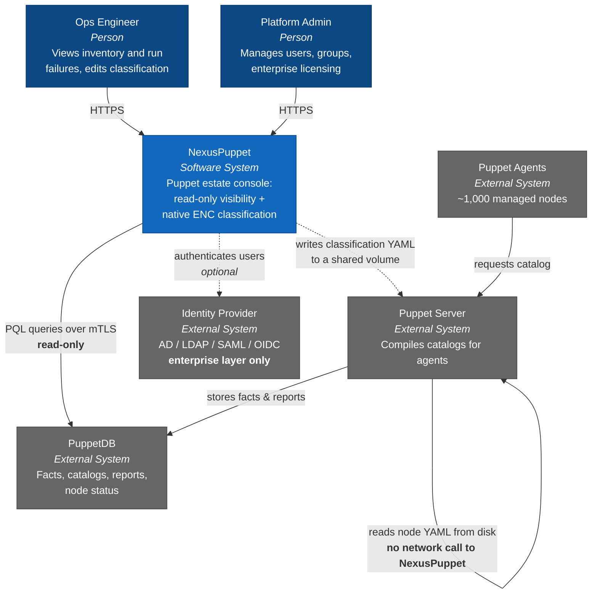

# C4 Level 1 — System Context

## Actors

| Actor | Needs |
|---|---|
| **Ops Engineer** | Find why a node's run failed, in under two minutes. See what a node is classified as and why. |
| **Platform Admin** | Manage users and roles, define node groups and matching rules, manage the enterprise licence. |

## External systems

| System | Relationship | Direction | Criticality |
|---|---|---|---|
| **PuppetDB** | PQL over HTTPS with mTLS client cert | NexusPuppet → PuppetDB, read-only | Degrades visibility features only |
| **Puppet Server** | Filesystem handoff — NexusPuppet writes YAML, `puppetserver` reads it via an `exec` node terminus | Indirect, asynchronous, no runtime coupling | **Deliberately zero runtime coupling** ([ADR-0003](./adr/0003-enc-generate-dont-serve.md)) |
| **Identity Provider** | Enterprise layer only; core uses local accounts | NexusPuppet → IdP | Optional, absent in core |

## The relationship that is deliberately absent

There is **no synchronous call from Puppet Server to NexusPuppet**. This is the defining constraint of the system context. A conventional ENC would draw an arrow `psrv → np` on the critical path of every agent run; that arrow does not exist here, and no future change may introduce it without superseding ADR-0003.
