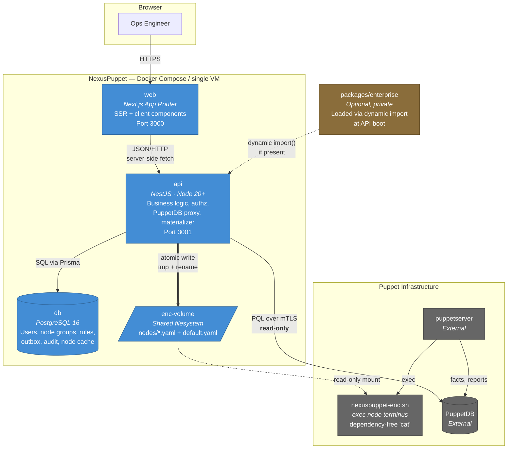

# C4 Level 2 — Containers

## Containers

| Container | Technology | Responsibility | Scaling |
|---|---|---|---|
| **web** | Next.js (App Router), React, TanStack Query, Tailwind + shadcn/ui | Rendering only. All data via `api`. Holds no credentials for PuppetDB or Postgres. | Stateless, horizontally scalable |
| **api** | NestJS, TypeScript | All business logic, authorization, PuppetDB client, ENC materializer, audit | Stateless **except** the materializer — see below |
| **db** | PostgreSQL 16 | Local state only ([ADR-0005](./adr/0005-postgres-prisma-local-state.md)) | Single instance in v1 |
| **enc-volume** | Docker volume / bind mount | The handoff surface to Puppet | Must be shared between `api` and `puppetserver` |

## Trust boundaries

1. **Browser → web** — session cookie, HTTPS.
2. **web → api** — server-side only; the browser never holds an API credential for PuppetDB. Authorization is enforced in `api`, never in `web`.
3. **api → PuppetDB** — mTLS client certificate. This credential is estate-wide and read-everything; `api` must reduce it to per-user scope before every query. See [ADR-0004](./adr/0004-puppetdb-read-only-mtls.md).
4. **api → enc-volume** — the only writer. Mounted `ro` everywhere else.

## Materializer placement

The ENC materializer runs **in-process inside `api`** in v1, guarded by a Postgres advisory lock so that running multiple `api` replicas does not produce concurrent writers to the same file.

At the stated scale (~1,000 nodes) this is comfortably adequate. If materialization becomes a bottleneck, the escape hatch is to run the same NestJS application with `ROLE=worker`, which starts the materializer and skips the HTTP listener — no code change, only deployment topology. The advisory lock makes that transition safe.

## Why `web` never touches the database

Next.js server components could technically query Postgres directly. They must not. Doing so would put authorization logic in two places and split the audit trail. `web` is a rendering tier with no data-layer credentials — enforced by an ESLint boundary rule (`apps/web` may not import `@prisma/client`).
