# C4 Level 3 — Components of `apps/api`

```mermaid
graph TB
    subgraph http["HTTP layer — controllers"]
        c_nodes["NodesController"]
        c_reports["ReportsController"]
        c_groups["NodeGroupsController"]
        c_auth["AuthController"]
        c_admin["AdminController"]
        c_health["HealthController"]
    end

    subgraph domain["Domain services"]
        s_inv["InventoryService<br/>node list, facts, status"]
        s_rep["ReportsService<br/>run reports, failure triage"]
        s_cls["ClassificationService<br/>groups, rules, class assignment<br/><b>enqueues outbox jobs</b>"]
        s_eval["RuleEvaluator<br/>pure: facts + rules → groups"]
        s_merge["ClassMerger<br/>pure: groups → single ENC doc"]
        s_audit["AuditService"]
    end

    subgraph mat["Materialization"]
        m_worker["MaterializerWorker<br/>drains outbox, advisory-locked"]
        m_render["EncYamlRenderer<br/>pure: doc → YAML string"]
        m_writer["EncFileWriter<br/>tmp write + atomic rename"]
        m_recon["ReconcilerService<br/>periodic full drift repair"]
    end

    subgraph infra["Infrastructure"]
        i_pdb["PuppetDbClient<br/>mTLS agent, PQL builder"]
        i_proj["NodeProjectionService<br/>PuppetDB → ManagedNode cache"]
        i_prisma["PrismaService"]
        i_auth["LocalAuthProvider<br/><i>implements IAuthProvider</i>"]
    end

    subgraph ent["Enterprise boundary"]
        e_load["EnterpriseLoader<br/><b>the only file permitted<br/>to import enterprise code</b>"]
        e_reg["CapabilityRegistry<br/>token → implementation"]
    end

    c_nodes --> s_inv
    c_reports --> s_rep
    c_groups --> s_cls
    c_auth --> i_auth
    c_admin --> s_audit

    s_inv --> i_pdb
    s_rep --> i_pdb
    s_cls --> i_prisma
    s_cls --> s_audit
    s_cls -.->|"outbox row in<br/>same transaction"| i_prisma

    m_worker --> i_prisma
    m_worker --> s_eval
    m_worker --> s_merge
    m_worker --> m_render
    m_worker --> m_writer
    m_recon --> m_worker
    s_eval --> i_prisma
    i_proj --> i_pdb
    i_proj --> i_prisma

    e_load --> e_reg
    e_reg -.->|"may override"| i_auth
    e_reg -.->|"may override"| s_audit

    classDef ctl fill:#85bbf0,stroke:#5d82a8,color:#000
    classDef svc fill:#438dd5,stroke:#2e6295,color:#fff
    classDef matc fill:#2e7d32,stroke:#1b5e20,color:#fff
    classDef inf fill:#666,stroke:#444,color:#fff
    classDef entc fill:#8a6d3b,stroke:#66512c,color:#fff
    class c_nodes,c_reports,c_groups,c_auth,c_admin,c_health ctl
    class s_inv,s_rep,s_cls,s_eval,s_merge,s_audit svc
    class m_worker,m_render,m_writer,m_recon matc
    class i_pdb,i_proj,i_prisma,i_auth inf
    class e_load,e_reg entc
```



## Component contracts

| Component | Purity | Notes |
|---|---|---|
| `RuleEvaluator` | **Pure function** | `(facts, rules) → matched group ids`. No I/O. Exhaustively unit-tested; this is where classification bugs would be silent and expensive. |
| `ClassMerger` | **Pure function** | `(ordered groups) → EncDocument`. Implements [ADR-0009](./adr/0009-classification-merge-semantics.md) merge and conflict rules. |
| `EncYamlRenderer` | **Pure function** | `(EncDocument) → string`. Deterministic key ordering so identical input always yields byte-identical output — this is what makes content-hash change detection work. |
| `EncFileWriter` | I/O, isolated | The only component that touches the ENC volume. Writes `<name>.yaml.tmp` then `rename()`. |
| `MaterializerWorker` | Orchestration | Holds a Postgres advisory lock. Drains `EncMaterializationJob`. Idempotent: re-running a job is always safe. |
| `EnterpriseLoader` | I/O, isolated | The **single** file exempted from the ESLint enterprise-import ban. |

## The write path, precisely

```
POST /node-groups/:id/classes
  │
  ├─ AuthGuard → RbacGuard          (authorization happens here, never downstream)
  │
  ├─ prisma.$transaction([
  │     write NodeGroupClass,
  │     write AuditLog,
  │     upsert EncMaterializationJob(dedupeKey)   ← the outbox
  │   ])
  │
  └─ 202 Accepted  { materializationJobId }

MaterializerWorker (async, advisory-locked)
  │
  ├─ claim PENDING jobs
  ├─ for each affected certname:
  │     load ManagedNode.facts (cache, not PuppetDB)
  │     RuleEvaluator  → groups
  │     ClassMerger    → EncDocument
  │     EncYamlRenderer → yaml string
  │     hash === EncMaterialization.contentHash ?  skip  :  EncFileWriter.write()
  │     upsert EncMaterialization
  └─ mark job DONE (or FAILED with backoff; attempts capped, then alerted)
```

The outbox row is written **in the same transaction** as the domain change. Either both land or neither does. A crash between commit and materialization loses nothing — the job is still `PENDING` on restart.

## Why the evaluator reads the cache, not PuppetDB

`RuleEvaluator` matches on facts. Fetching facts live from PuppetDB during materialization would reintroduce the coupling ADR-0003 exists to remove — a PuppetDB outage would then block classification changes. Instead `NodeProjectionService` refreshes `ManagedNode` on a schedule, and materialization reads only Postgres.

Consequence, stated plainly: a node whose facts changed since the last projection may be classified against slightly stale facts. Bounded by the projection interval, surfaced in the UI as a "facts as of" timestamp, and forced fresh by the reconciler.
