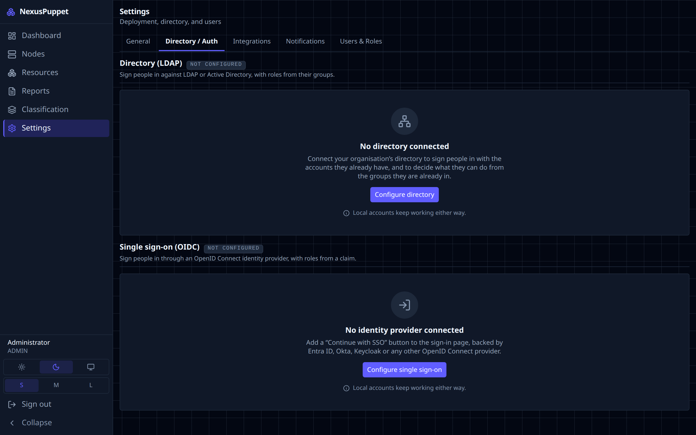
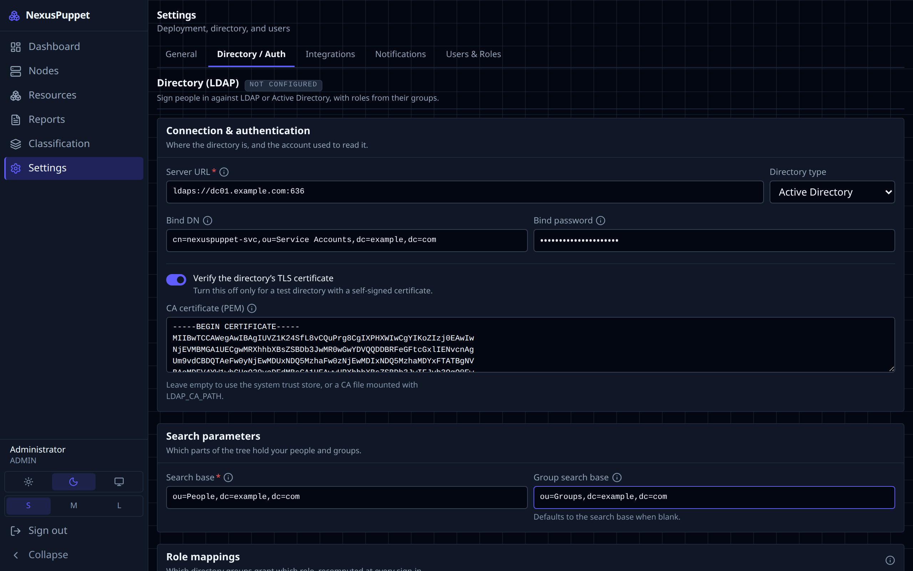

# Sign-in & users

People sign in with a **local account** (a password kept by NexusPuppet), a **directory account** (LDAP or Active Directory), or **single sign-on** (OIDC — Entra ID, Okta, Keycloak and others). You can use all three at once. Local accounts always keep working, whatever you do with a directory.

> **The rule that catches everyone: NexusPuppet does not create accounts on first sign-in.** Every person needs an account in **Settings → Users & Roles** before they can sign in — including directory and single sign-on users. Without one, a correct password is refused with the same message as a wrong one. Create the account first, with **Authentication** set to `ldap` or `oidc`.

## Roles

| Role | Can |
|---|---|
| **VIEWER** | Read everything: nodes, facts, reports, classification |
| **OPERATOR** | Everything a viewer can, plus change classification |
| **ADMIN** | Everything, including users and settings |

These three are fixed. To make your own, duplicate one in **Settings → Users & Roles** and change its permissions.

## Local accounts

**Add someone:** **Settings → Users & Roles → New user**. Enter their email, a display name, a role and a first password. Send them the password through a safe channel and ask them to change it.

**Change your own password:** **Settings → General → Change your password**. This signs you out everywhere else.

**Reset someone else's password:** an administrator opens **Settings → Users & Roles** and uses the key button on that person's row to set a new one. Directory and single sign-on users change their password in the directory, not here.

**Locked out after too many attempts?** The lock lifts by itself after a while, or another administrator can reset the password.

Two safety rules: you cannot delete or deactivate your own account, and you cannot remove the last active administrator.

### Forgotten administrator password

If another administrator can sign in, they can set a new password for you as above. If nobody can, reset it on the server, from the install directory (usually `/opt/nexuspuppet`):

```bash
sudo ./scripts/deploy.sh --reset-admin admin@example.com
```

It asks for the new password twice, without showing it. It works even when the API is down. It sets the password, unlocks and reactivates the account, ends its sessions, and records `user.password.reset` in the audit log. It is for local accounts only; directory and single sign-on users reset their password in the directory.

Available from the release after v1.11.0. The command lives in the console's image, so **on a server last upgraded to v1.11.0 or earlier, run the upgrade once first** — it rebuilds the image and needs no login — then run the command:

```bash
sudo ./scripts/deploy.sh
sudo ./scripts/deploy.sh --reset-admin admin@example.com
```

If you skip that, the command says so before asking for a password, and changes nothing.

## Connect LDAP or Active Directory

Everything happens in the console. There is no file to edit and nothing to restart.



1. **Be on 1.11 or later, installed with `scripts/deploy.sh`.** It adds the `CONFIG_ENCRYPTION_KEY` the console needs to store the bind password (see [Install & upgrade](install.md#upgrade)). If the page says *Saving a bind password needs CONFIG_ENCRYPTION_KEY*, re-run `./scripts/deploy.sh`.
2. Open **Settings → Directory / Auth**. The **Directory (LDAP)** section says **Not configured**. Click **Configure directory**.
3. Fill in the connection:
    - **Server URL** — use the server's **name**, exactly as it appears on its certificate: `ldaps://dc01.example.com:636`. Not its IP address; domain controller certificates rarely include one.
    - **Directory type** — *Active Directory* or *OpenLDAP*.
    - **Bind DN** and **Bind password** — a service account that can search the directory, such as `cn=nexuspuppet-svc,ou=Service Accounts,dc=example,dc=com`.
    - Leave **Verify the directory's TLS certificate** on.
    - **CA certificate (PEM)** — paste the certificate of the CA that signed the directory's certificate, from `-----BEGIN CERTIFICATE-----` to `-----END CERTIFICATE-----`. Include intermediates if there are any. It is public; never paste a private key. Not needed if the directory's certificate comes from a public CA.
4. Fill in **Search base** — where your users are, such as `dc=example,dc=com`. **Group search base** is optional.
5. Under **Role mappings**, map at least one directory group to a role, for example `cn=puppet-admins,ou=Groups,dc=example,dc=com` → `ADMIN`. **A user in none of the mapped groups is refused.** There is no default role for LDAP.
6. Click **Test connection**. It binds and searches with what you typed, without saving. Fix anything it reports — see [When the test fails](troubleshooting.md#the-directory-test-fails).
7. Click **Save**. It applies from the next sign-in; the badge changes to **Saved in the console**.
8. **Create the accounts.** In **Settings → Users & Roles → New user**, enter each person's email — it must match their `mail` attribute in the directory — and set **Authentication** to `ldap`. No password. The role you pick is replaced at each sign-in by what their groups map to.
9. **Sign in.** Active Directory users type their username (`jdoe`) or `jdoe@example.com`; OpenLDAP users type their email address.



You can create accounts before the directory is configured; the dialog marks the source *not configured yet*, and those people can sign in once you save. The login page only offers a directory once it is configured.

To undo, open the form and use **Discard stored settings**. Directory users are then refused at their next sign-in; local accounts are unaffected.

## Connect single sign-on (OIDC)

1. Register NexusPuppet with your identity provider. The redirect URI is `https://<your console>/api/auth/callback`.
2. Open **Settings → Directory / Auth**, find **Single sign-on (OIDC)**, and click **Configure single sign-on**.
3. Enter the **Issuer**, **Client ID**, **Client secret** and the same **Redirect URI**. Check the **Claims** that carry email, display name and groups.
4. Map group claim values to roles under **Role mappings**, or set a **Role for everyone else**.
5. Test, then **Save**. The login page now shows a single sign-on button.
6. Create each person's account with **Authentication** set to `oidc`, as above.

On Entra ID, limit the groups claim to the groups assigned to the application. Entra stops sending groups for people in more than about 150 of them, and those users are refused. More in [DEPLOYMENT.md](../../DEPLOYMENT.md#pointing-at-entra-id-oidc).

## Configuring from `.env` instead

The `LDAP_*` and `OIDC_*` variables in `.env` still work, and need an API restart to change. Settings saved in the console take precedence over them. [DEPLOYMENT.md](../../DEPLOYMENT.md#2-one-image-every-feature) has the details.
