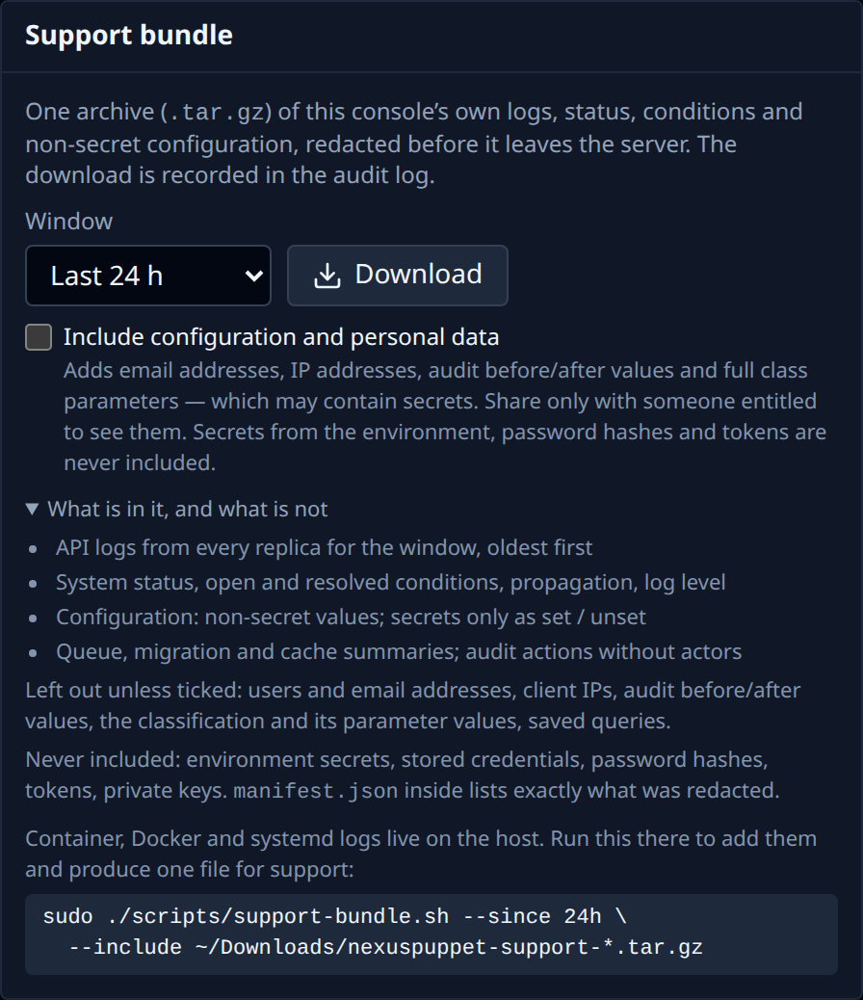

# Troubleshooting & support

**First, check whether it matters.** If NexusPuppet is down, your Puppet runs are not affected: the Puppet server keeps reading the last classification it was given. You can fix the console at your own pace.

The commands below run on the NexusPuppet host, in the directory you installed it in (usually `/opt/nexuspuppet`). Add `sudo` if your account is not in the `docker` group.

## Common problems

### "PuppetDB unreachable"

The console shows when it last reached PuppetDB, even after a restart. Run the installer's checks — they test the certificate, PuppetDB's answer and the network, and name the fix:

```bash
./scripts/deploy.sh --check
```

The usual causes:

- **The certificate cannot be read by the container.** It runs as uid 100, so files owned by `root` with mode `0600` are invisible to it.
- **NexusPuppet's certname is not in PuppetDB's allowlist.** PuppetDB answers `403`, which looks like a bad certificate but is not.
- **The URL is wrong**, or PuppetDB has no TLS listener on 8081 yet.

Full details: [DEPLOYMENT.md §3](../../DEPLOYMENT.md#3-puppetdb-certificates).

### The node list is empty, with no error

The first read of PuppetDB has not finished yet — give it a few minutes. If it stays empty, run `./scripts/deploy.sh --check`: a certificate the container cannot read also shows up as an empty estate.

### A rule matches no nodes

- **The fact is not collected.** Rules only see the facts listed in `PUPPETDB_PROJECTED_FACTS` in `.env`. Open a node's **Facts** tab: if the fact is not there, add its top-level name to that list and run `./scripts/deploy.sh` again.
- **The fact name is wrong.** Puppet 8 and OpenVox no longer report `fqdn` or `domain` — use `networking.fqdn`. `role` exists only if one of your modules provides it.

### A change is saved but nodes have not changed

That is expected until each node's next Puppet run. On the node's page, the **Materialization** panel shows when its file was last written. If it was written but the node still gets the old classes, check the Puppet server wiring ([DEPLOYMENT.md §6](../../DEPLOYMENT.md#6-wiring-puppetserver)).

### The directory test fails

**Test connection** under **Settings → Directory / Auth** shows the directory's own error.

| Error mentions | Cause and fix |
|---|---|
| `EAI_AGAIN`, `ENOTFOUND`, or the name not resolving | The API container cannot look up your domain controller's name. Give it your DNS server: in `docker-compose.override.yml`, under `services: api:`, add `dns: [<your DNS server's IP>]`, then `docker compose up -d api`. An `extra_hosts` entry is **not** enough. |
| *not valid for the name*, "altnames", or "does not match" | **Server name or IP** is not a name on the directory's certificate. Use the hostname exactly as on the certificate, not the IP address. |
| *certificate is not trusted*, "self-signed", or "local issuer" | NexusPuppet does not trust the CA that signed the directory's certificate. Paste that CA (and any intermediates) into **CA certificate (PEM)**. |
| *The server refused STARTTLS* | The server has no certificate for STARTTLS on that port, or expects LDAPS. Choose **LDAPS** and port 636. Nothing was sent unencrypted. |
| *The TLS handshake … failed … choose STARTTLS* | You chose **LDAPS** on a port that speaks plain LDAP (usually 389). Choose **STARTTLS**, or LDAPS with port 636. |
| *Nothing is accepting connections* | Wrong **Port**, or a firewall between the console and the directory. |
| *refused the User DN and password* | The **User DN** or **Password** of the service account is wrong. |
| *A UPN pattern … only works against Active Directory* | With **Simple** on OpenLDAP, use a DN pattern such as `uid={username},ou=people,dc=example,dc=com`. |
| *This directory does not allow anonymous searches* | Normal for Active Directory and many OpenLDAP servers. Choose **Regular** and give a service account (**User DN** and **Password**). The directory's own words are on the line below the message. |
| *The search base was not found — or this directory hides it from anonymous readers* | Either **Search base** is mistyped, or (OpenLDAP) anonymous readers may not see it. Check the base, or use **Regular**. |
| *the directory type is unknown* | The server hides what kind it is from anonymous readers. Everything still works if it is OpenLDAP; for Active Directory use **Regular** (the service account can read it) or set `LDAP_DIALECT=ad` in the environment. |

If the page says *Saving a bind password needs CONFIG_ENCRYPTION_KEY*, run `./scripts/deploy.sh` once — it adds the key.

### Someone cannot sign in

A refused sign-in always shows the same message, whatever the cause, so that nobody can use the login page to find out which accounts exist. The API log says the real reason:

```bash
docker compose logs api | grep -i "login refused\|not configured"
```

| The log says | Fix |
|---|---|
| *no NexusPuppet account exists* | Create their account in **Settings → Users & Roles**, with **Authentication** set to `ldap` (or `oidc`), and the email that is in their directory entry. NexusPuppet never creates accounts automatically. |
| *member of no mapped group* | Their password is fine, but none of their groups is under **Role mappings**. Add the group, or add them to a mapped group. |
| *LDAP sign-in is not configured* | The directory has not been saved. Finish [Connect LDAP or Active Directory](sign-in.md#connect-ldap-or-active-directory). |

Also check the account is **active**, and not locked after too many attempts (wait, or have an administrator reset it). A local administrator can always still sign in.

## Send a support bundle

When you need help from someone else, send them a support bundle. It has two halves.

**1. From the console.** **Settings → General → Support bundle** (administrators). Choose how far back to go — 1, 6, 24 or 72 hours — and click **Download**.



The default bundle contains the API's logs, the system status, every open problem and how long it has been open, and the configuration — with **no** passwords, secrets, user names, email or IP addresses. It is safe to attach to a ticket. Open `summary.txt` in it first: the most urgent problem is at the top.

Tick **Include configuration and personal data** only if support needs to see users, the full audit trail or your classification's parameter values. That file is named `…-with-personal-data.tar.gz`; share it only with someone entitled to see that information. Passwords, tokens and private keys are never included either way.

**2. From the host.** The console cannot see container logs, Docker's state or the system journal. Copy the file you downloaded to the host (`scp`), then collect the rest and include it, so support gets a single file:

```bash
sudo ./scripts/support-bundle.sh --since 24h --include ~/nexuspuppet-support-*.tar.gz
```

Run it on the NexusPuppet host, and on each Puppet server if the problem involves classification reaching nodes. It masks secret values from `.env` everywhere. Look inside before sending (`tar -tzf <file>`). Nothing is uploaded anywhere automatically.

## Where the logs are

| What | Where |
|---|---|
| The API, the web console, the proxy | `docker compose logs api` (or `web`, `proxy`) |
| The API's recent history, kept for support bundles | the `api-logs` volume, about 120 MB per API container, rotated |
| Who changed what | the audit log, in the database; forward it with **Settings → Integrations** |
| The Puppet server's side | `journalctl -u 'nexuspuppet-*'` on the Puppet server |

More: [DEPLOYMENT.md, Troubleshooting](../../DEPLOYMENT.md#troubleshooting) and the [user guide's troubleshooting](../USER_GUIDE.md#12-troubleshooting).
