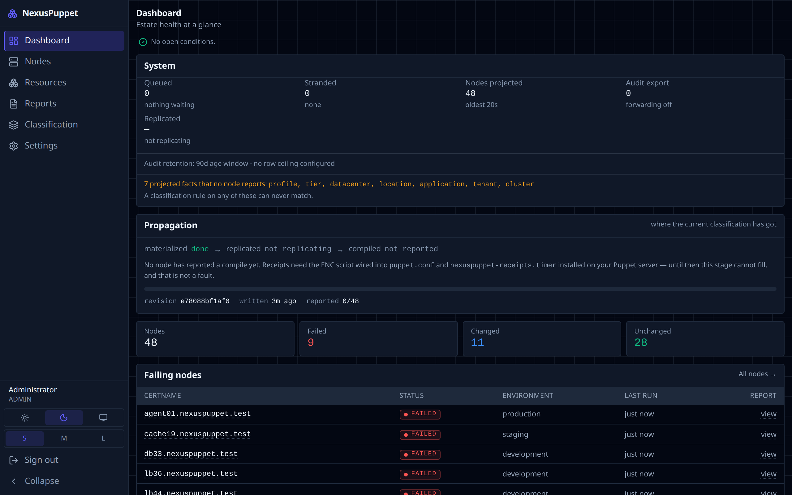
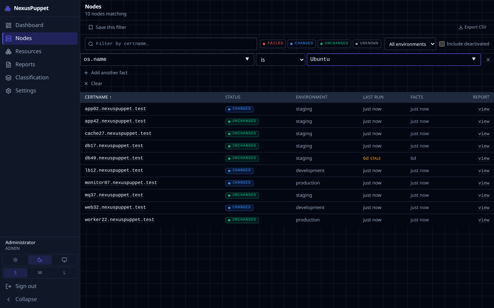
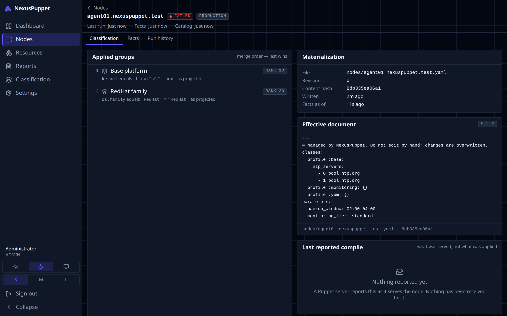
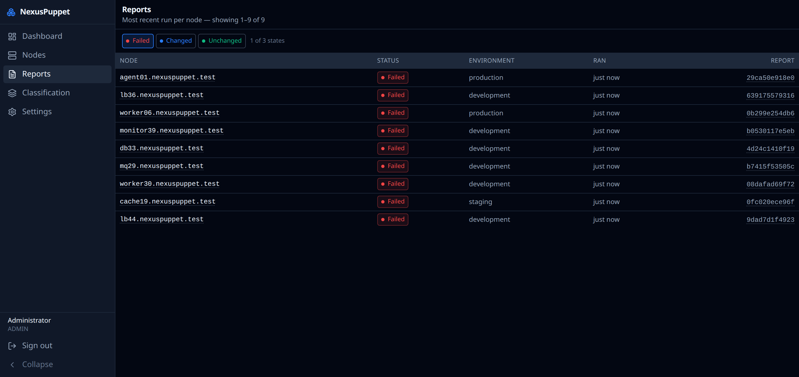
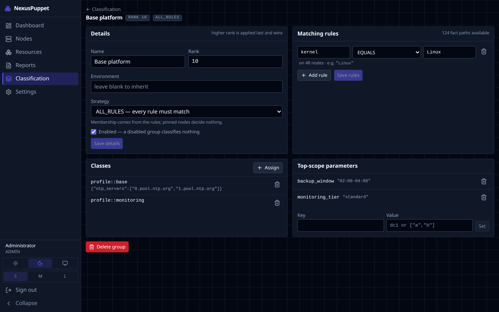
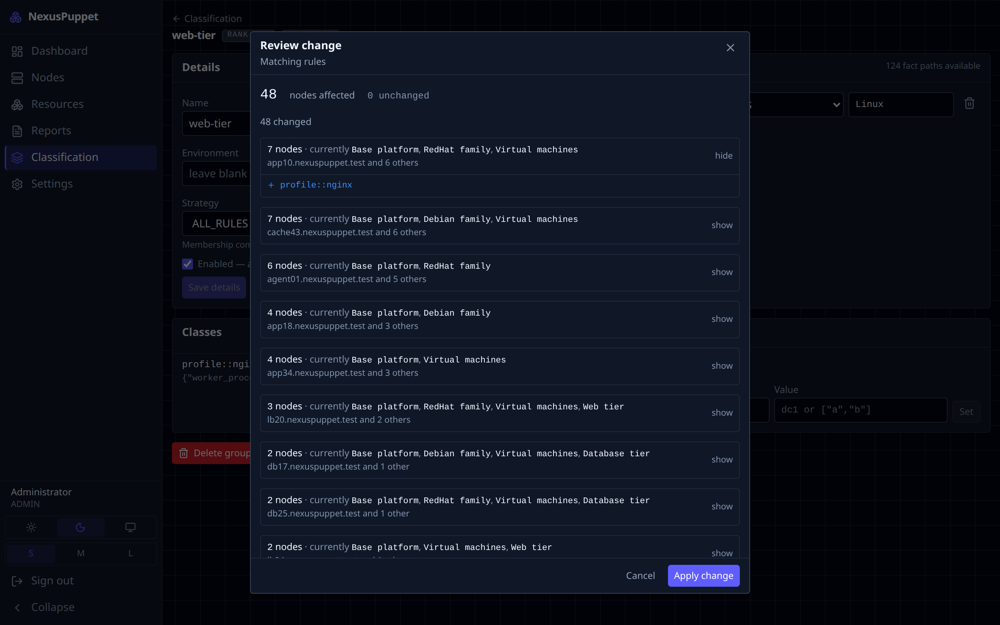
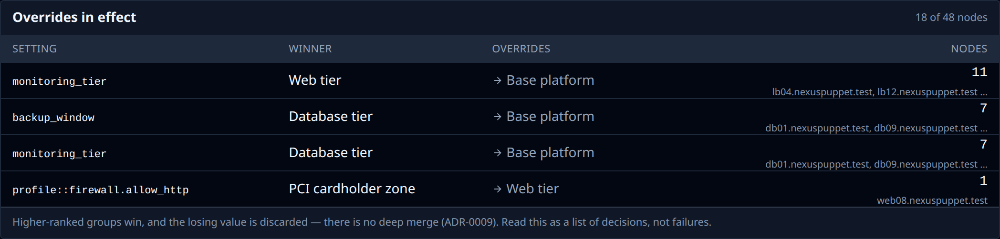
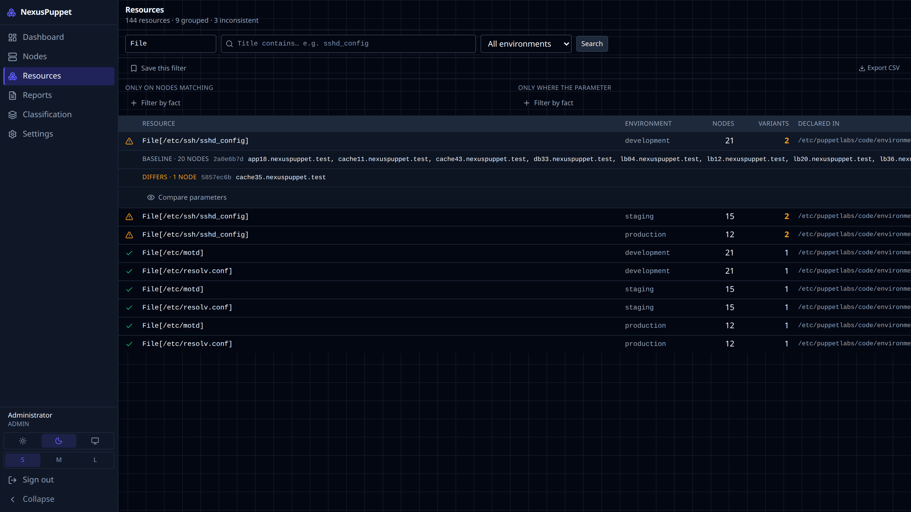
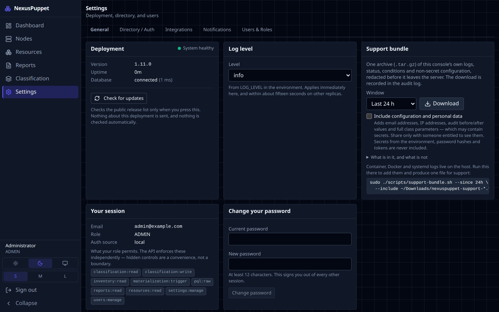

# Using the console

A short tour. Every screen is described in detail in the [user guide](../USER_GUIDE.md).

## The one thing to know first

When you save a classification change, NexusPuppet writes a file for each affected node within seconds. Your Puppet server reads that file on the node's **next Puppet run**. So a saved change says *queued*, not *done* — that is normal. The console also reads PuppetDB on a schedule rather than live, so a node that checked in a moment ago can take a few minutes to appear.

## Dashboard

How many nodes there are, how their last runs went (failed, changed, unchanged), and a list of failing nodes linking straight to each one.

## Nodes

Every node PuppetDB knows about. You can:

- **Filter by fact** — for example `os.name` equals `Ubuntu`. The value box suggests what your estate actually reports.
- **Filter by certname**, status (failed, changed, unchanged, unknown) and environment.
- **Save this filter** to reuse it. Saved filters are private unless you tick **Share**; colleagues only see a shared filter if they are allowed to run it.
- **Export CSV** — the whole filtered list, not just the page on screen.

Open a node to see its facts, its recent runs, and its **classification**: which groups it belongs to, in which order, and what file was written for it.

## Run reports

Recent Puppet runs across the estate. Open one to see every resource Puppet changed, failed or skipped. For a failure, read the message and the **containment path** — the chain of classes that declared the resource, which usually points at the manifest to fix. Skipped resources are a side effect of a failure, not failures themselves.

## Classification

Classification decides which Puppet classes each node receives. It is organised in **node groups**. A group has:

- **Matching rules** — which nodes belong, written against facts (`os.family` equals `RedHat`, `networking.fqdn` matches `^web`). Use structured fact names such as `networking.fqdn`; Puppet 8 and OpenVox no longer report the old flat `fqdn`.
- **Pins** — specific nodes added by name, whatever the rules say.
- **Classes and parameters** — what members get, such as `profile::nginx` with `worker_processes: 4`.
- **Rank** — when two groups set the same parameter, the higher rank wins. Classes from every matching group are combined; a parameter value is replaced as a whole, never merged.

### Every change is previewed

Whatever you edit, **Save** opens a review first: how many nodes are affected, what changes on them (grouped by outcome, with an example node for each), and whether the change makes one group start overriding another. **Cancel** is the default button. Nothing is written until you apply.

### Overrides in effect

The Classification page lists every place where one group is overriding another's value, and on how many nodes. Overriding a base group is often intended; this makes it visible. If a parameter you set "has no effect", look here first — a higher-ranked group is probably setting it too.

## Resources: do these nodes agree?

**Resources** searches what nodes actually received in their catalogs. Pick a type (`File`, `Package`, `Service`) and optionally a title. Each resource shows how many **variants** exist among the nodes that have it: one variant means every node is identical; more than one means some differ, and expanding the row names them. **Compare parameters** shows exactly what differs.

Seeing resource parameters needs the `resources:read` permission, because a managed file's content can contain a password. Every parameter view is recorded in the audit log. Searches can be saved and exported, like node filters.

## Settings

Under **Settings**, everyone can change their own password (**General**). Administrators also manage **Directory / Auth** (LDAP, Active Directory, single sign-on — see [Sign-in & users](sign-in.md)), **Integrations** (forwarding the audit log to syslog or a webhook), **Notifications**, and **Users & Roles**. **General** also holds the **Support bundle** — see [Troubleshooting & support](troubleshooting.md#send-a-support-bundle).
